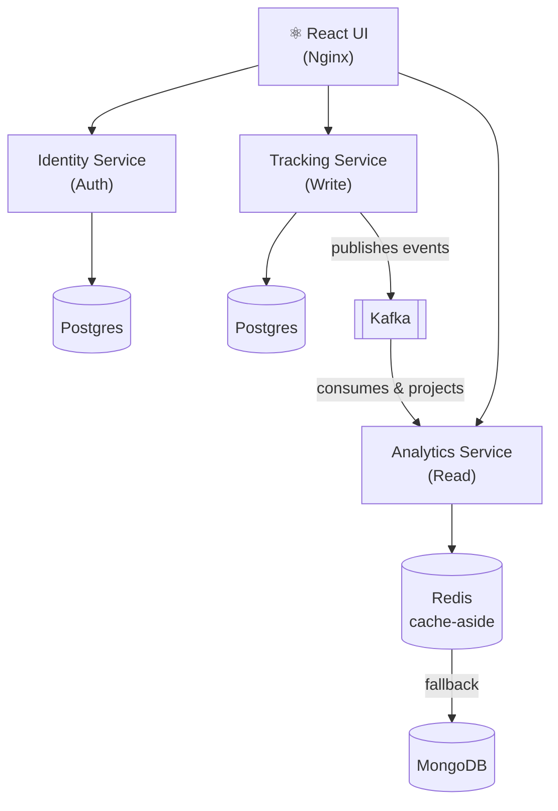

# Speculo

> A distributed lifestyle tracking platform built with .NET microservices, deployed on Azure Kubernetes Service.

**Live**: [http://speculo-app.westus2.cloudapp.azure.com](http://speculo-app.westus2.cloudapp.azure.com)

---

## What It Does

Speculo gives users a single dashboard to track and reflect on four pillars of daily life:

- **Mood** — Log emotional state on a 1–10 scale with notes
- **Sleep** — Record hours slept and sleep quality
- **Workouts** — Track exercise type, duration, and intensity
- **Finances** — Log income and expenses by category

Events are written to the Tracking service, published to Kafka, consumed by the Analytics service, and projected into a MongoDB read model — giving the dashboard real-time aggregated stats.

---

## Architecture



The Analytics Service runs both roles in a single deployment: an HTTP read API and a Kafka `BackgroundService` consumer. There is no separate consumer process.

### Services

| Service | Responsibility | Database | Port |
|---------|---------------|----------|------|
| **Identity** | Registration, login, JWT issuance (BCrypt hashing) | PostgreSQL | 5001 |
| **Tracking** | Event ingestion, validation, CQRS command handling | PostgreSQL | 5000 |
| **Analytics** | Read projections, dashboard queries, Redis caching | MongoDB + Redis | 5002 |

### Key Design Decisions

- **CQRS** — Commands go to Tracking (PostgreSQL event store), queries are served by Analytics (MongoDB). Write and read models are optimised independently.
- **Event-driven** — Tracking publishes typed integration events to Kafka. Analytics consumes them asynchronously to build materialised views. Services share only `Speculo.Contracts` — no direct dependencies.
- **Idempotent consumers** — Each Kafka message carries an `event-id` header. The consumer checks a `ProcessedEvents` collection in MongoDB before applying a projection, making it safe under at-least-once delivery.
- **Cache-aside with Redis** — Dashboard reads hit Redis first (5-minute TTL). On every Kafka event consumed, the affected user's cache key is deleted, so the next read gets a fresh projection from MongoDB.
- **API Gateway** — Nginx in the frontend container routes `/api/identity/`, `/api/tracking/`, and `/api/analytics/` to the respective backend services. Single entry point for the client.

---

## Tech Stack

| Layer | Technologies |
|-------|-------------|
| Backend | .NET 9, ASP.NET Core, Entity Framework Core, MediatR, FluentValidation |
| Frontend | React 19, TypeScript, Vite, Tailwind CSS |
| Messaging | Apache Kafka |
| Databases | PostgreSQL 17, MongoDB 7 |
| Caching | Redis 7 |
| Infrastructure | Docker, Kubernetes (AKS), Azure Container Registry, Nginx |
| CI/CD | GitHub Actions — build + test on every PR; build images, push to ACR, deploy to AKS on merge to `main` |

---

## Project Structure

```
├── Speculo.Tracking/               # Tracking microservice
│   ├── Speculo.API/                #   ASP.NET Core entry point
│   ├── Speculo.Application/        #   CQRS handlers, MediatR pipelines
│   ├── Speculo.Domain/             #   Entities and domain events
│   ├── Speculo.Infrastructure/     #   EF Core, Kafka producer, repositories
│   └── Speculo.Application.UnitTests/  # xUnit tests
├── Speculo.Identity/               # Identity microservice (auth + JWT)
├── Speculo.Analytics/              # Analytics microservice (projections + queries)
├── Speculo.Contracts/              # Shared Kafka event contracts
├── speculo-client/                 # React frontend
├── k8s/                            # Kubernetes manifests (AKS)
├── docker-compose.yml              # Local development stack
├── Dockerfile                      # Tracking service image
├── Dockerfile.identity             # Identity service image
└── Dockerfile.analytics            # Analytics service image
```

---

## Getting Started

### Prerequisites
- Docker Desktop

### Run Locally

```bash
docker compose up -d --build
```

Open [http://localhost:3000](http://localhost:3000) — register an account, log some events, and watch the dashboard update.

### Run Tests

```bash
dotnet test
```

---

## Deployment

Production runs on **Azure Kubernetes Service** with images stored in **Azure Container Registry** (`speculoacr2025`).

Deployment is fully automated — every push to `main` triggers the GitHub Actions CD pipeline:

1. Builds all four Docker images (tracking, identity, analytics, frontend)
2. Pushes them to ACR tagged with the commit SHA and `latest`
3. Connects to the AKS cluster (`speculo-aks`) and runs `kubectl apply`
4. Rolls out a restart on each deployment to pull the new images

To deploy manually:

```bash
# Apply stateful infrastructure (databases, Kafka, Redis)
kubectl apply -f k8s/stateful-services.yaml

# Deploy application services and frontend
kubectl apply -f k8s/apps.yaml
```
